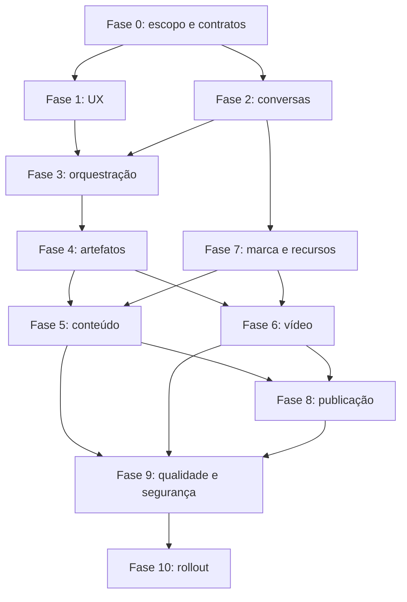

# 15 — Sequenciamento, dependências e marcos

## Ordem recomendada

## Marcos

### M1 — Conversa funcionando

Inclui Fases 0, 1 e 2.

Resultado:

- conversa persistente;
- streaming;
- anexos;
- layout aprovado;
- nenhuma geração ainda é requisito.

### M2 — Chat que cria artefatos

Inclui Fases 3, 4 e 5.

Resultado:

- ideias;
- copy;
- roteiros;
- carrosséis;
- imagens;
- versões;
- revisão conversacional.

### M3 — Chat que produz vídeo

Inclui Fase 6 e parte da Fase 7.

Resultado:

- plano de vídeo;
- storyboard;
- atores;
- vozes;
- quote;
- job;
- preview;
- refinamento.

### M4 — Chat que distribui

Inclui Fases 8 e 9.

Resultado:

- adaptação por canal;
- aprovação;
- exportação;
- agendamento;
- publicação;
- auditoria;
- segurança operacional.

### M5 — Lançamento

Inclui Fase 10.

Resultado:

- MVP interno;
- beta fechado;
- migração de `/creative`;
- rollout gradual;
- rollback testado.

## Paralelização

Podem ocorrer em paralelo:

- F1 UX e F2 API de conversas, depois que F0 fechar contratos;
- renderizadores frontend e schemas backend, usando fixtures;
- Brand DNA e artefatos;
- avaliação de IA enquanto o pipeline de vídeo é implementado.

Não devem ocorrer em paralelo sem contrato:

- frontend de artefato antes do schema;
- geração antes de quote e idempotência;
- publicação antes de aprovação;
- migração de rota antes de rollback.

## Estratégia de rollout técnico

1. feature flag desligada;
2. rota nova acessível internamente;
3. MVP com usuários internos;
4. beta por organização;
5. `/creative` encaminhando para Studio;
6. modo avançado preservado;
7. monitoramento;
8. rollout geral.

## Critério final de sequência

Uma fase pode começar quando suas dependências estiverem aprovadas. Uma fase só
é considerada concluída quando seu gate específico e a matriz de testes
correspondente estiverem verdes.
